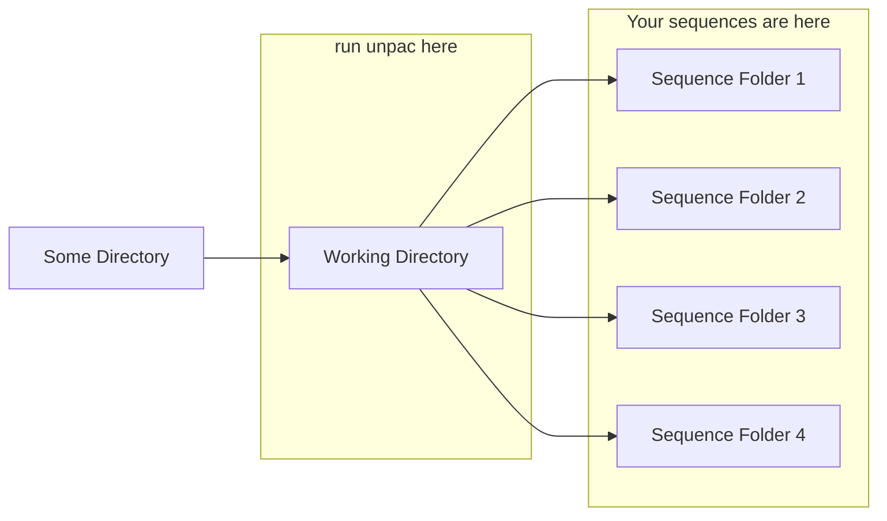

# unpac
#### unpacking pacbio sequences
This is a script written in `bash` meant to automate some basic processing of multi-cell PacBio sequences after they are downloaded from a sequencing facility. If you think of PacBio sequences as a package, then name is derived from `un`packing the `pac`bio reads. It was either that or `process_pacbio`, which isn't as fun.

## Usage
##### `unpac` is meant to be run in your working directory (see below "How to get it working correctly")
To process only `subreads.bam`
```sh
unpac -o <output.prefix>
```
To process `subreads.bam` and `scraps.bam`
```sh
unpac -o <output.prefix> -s
```
An example of processing both subreads and scraps for a species of fish
```sh
unpac -o swordfish -s
```

## Dependencies
|Package|Installed by default?|Source|
|---|---|---|
|GNU Parallel | very likely | https://www.gnu.org/software/parallel/  |
|samtools   | typically not | http://www.htslib.org/   |
|rename   | likely  | installs via homebrew (macOS) or Linux package managers |

## Why would you use this?
If you had sequencing done of a single individual (or species) across several cells, each run is returned to you as a folder containing `.bam` files of your sequences (among other things). You may need these files in `.fasta` format for your pipeline, and multiple sequences combined into a single sequence file.

## What it does
1. Convert `.bam` files into `.fasta` files
a. It will by default do this only for `.subreads.bam` files
b. There is an optional flag to also process `.scraps.bam` files (which may take a while)
c. `GNU parallel` will automatically assign how many cores your system will use based on the number of `subreads.bam` files it finds
2. Concatenate all of the converted `.fasta` files into a single file
3. Count the number of sequences in the concatenated `.fasta`
4. Count the number of total base pairs in the concatenated `.fasta`
5. Create a textfile with those counts for your records

## How to get it working correctly
Unfortunately, I'm not a master coder, so I can't [yet] write something that will just universally work for all cases. The PacBio sequences we receive have a specific file/folder structure, which is a single folder (let's call this the **working directory**) that contains other folders which contain our sequence data (let's call these the **sequence folders**). If your sample was run on several cells, in theory you should be receiving one working directory filled with as many sequencing folders as cells you purchased. If youre sequences are scattered, just move the folders around until they have this structure. It doesn't matter what you name any of the folders.
##### Here's a diagram of what it should look like:


